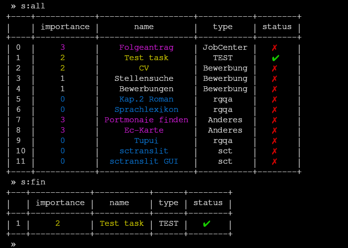

# ToDo (beta)

> v0.1.1  

Small command line application for managing your tasks in a very easy way.

(Still a couple of problems.)

- [To-Do](#to-do)
- [Installation](#installation)
- [Usage](#usage)
- [License](#license)
- [Author](#author)

## To-Do

- [x] Creating new tasks
- [x] Finishing tasks
- [ ] Correct coloring
- [ ] Deleting files (without finishing)
- [ ] Fuzzy search
- [ ] Sorting tasks
- [ ] Showing tasks because of difficulty
- [ ] Depending tasks(?)

## Installtion

--missing--

## Usage

--missing--

## License

No license yet. Please contact i.stemmert@gmail.com for questions.

## Author

__BertrandTerrier__ *(Immanuel Stemmert)*

> for support or suggestions please write at i.stemmert@gmail.com
